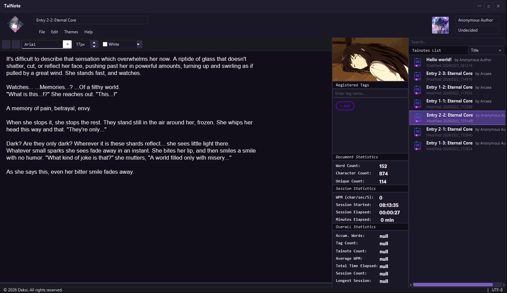

# Tainote: Learn your writing habits!

A comprehensive note-taking application with data visualization




---

## Features

### Writing
- **Distraction-free editor** — Clean, minimal UI that stays out of your way
- **Font & style controls** — Font family, size, and color picker in the toolbar
- **Author & status tagging** — Attach metadata to every note

### Stats
- **Document stats** — Live word count, character count, and unique word count
- **Session stats** — WPM, session start time, elapsed time, and minutes active

### Data
- **Persistent local database** — Notes are saved and indexed via SQLite
- **Note syncing** — Startup reconciliation between local files and the database
- **Export & import** — Move your notes in and out of the app

### Personalization
- **Themes** — Light, Chaos, and Sakura themes
- **Companions** - Switch from Tairitsu, Agnes Tachyon, Megumin
---

## In the Works

### Editor
- **Tabbing** — Open multiple notes simultaneously
- **Find & replace** — Search and replace within the editor
- **Key configuration** — Rebind shortcuts to your preference

### Stats & Visualizer
- **Overall statistics** — Accumulated word count, average WPM, total time, session count, longest session
- **Visualizer** — Daily, weekly, and monthly writing stats

### Organization
- **Registered tags** — Organize and browse notes by tag
- **Filtering** — Filter the notes list by tag, status, or author

### Export
- PDF · Markdown · Plain text
---

## Getting Started

### Prerequisites
- Java 21+

### Running from source

```bash
git clone https://github.com/Relay-RBX/tainote.git
cd tainote
mvn javafx:run
```

---

## Built With
- Java 21
- JavaFX
- SQLite (local database)
---

## Author
Made by dekxi
